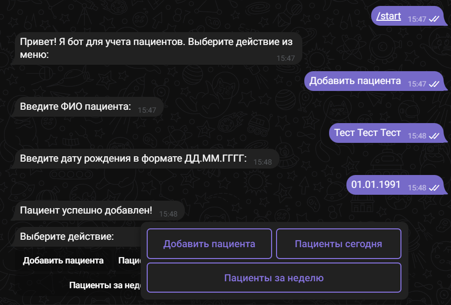
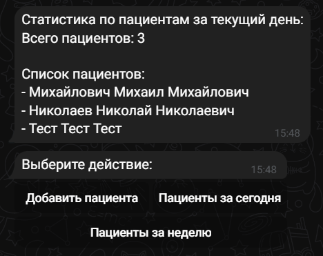
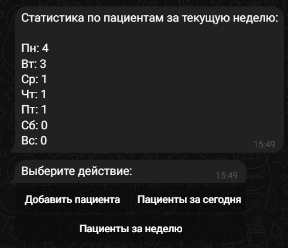

# Medical Bot Project

Этот проект представляет собой Telegram-бота для управления пациентами медицинского учреждения.

## Установка

1. Клонируйте репозиторий:
   ```bash
   git clone https://github.com/NikolayGertsog/w2w_test_project_medical_bot.git
   cd medical_bot_project

2. Создайте и активируйте виртуальное окружение
(Либо используйте альтернативный вариант, см. ниже):
    ```bash
    python -m venv venv
    source venv/bin/activate

Для Windows:
    ```bash
    venv\Scripts\activate

3. Установите зависимости:
    ```bash
    pip install -r requirements.txt

4. Настройте базу данных:
    ```bash
    python manage.py migrate

5. Запустите бота:
    ```bash
    python patients/bot.py

## Альтернативный вариант:

Если вы хотите запустить проект без создания виртуального окружения, выполните следующие шаги:

- Убедитесь, что все зависимости установлены, используя команду 
    ```bash
    pip install -r requirements.txt

- Настройте базу данных, если необходимо, с помощью команды 
    ```bash
    python manage.py migrate

- Запустите сервер разработки Django, используя команду
    ```bash
    python manage.py runserver

Этот вариант используется в случае, если у вас уже настроена среда разработки и не требуется изолированное виртуальное окружение.


## Использование
https://t.me/w2w_test_project_medical_bot

После запуска бота используйте команды или кнопки в Telegram для управления пациентами:

/add_patient - Добавить нового пациента.



/patients_today - Просмотреть пациентов, пришедших сегодня.



/patients_per_day - Просмотреть статистику по пациентам за текущую неделю.

